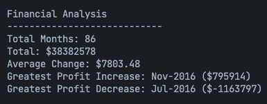

# Bootcamp Module 4 Challenge: Console Finances

## Description

This challenge was designed to help students practice and expand on JavaScript fundamentals learned throughout the previous week.

In `index.js` code was created for analyzing the financial records of a company. This analysis, once complete, should print its results to the browser console.

## Tasks

These are the results that we were tasked with calculating and printing to the console:

- Total number of months included in the dataset.

- Net total amount of profit/losses over the entire period.

- Average of the changes in profit/losses over the entire period.

- Greatest increase in profits (date and amount) over the entire period.

- Greatest decrease in losses (date and amount) over the entire period.

- When opening the code in the browser, the financial analysis should be displayed like so:

  

## GitHub Pages

Deployed version of this project can be seen [here](https://vcdsc.github.io/console-finances/). **Warning**: to see the results in the browser console, right click on the page, select "Inspect" and on the window that will open to your right, on the top, select "Console".

## License

Please refer to the LICENSE in the repo.
